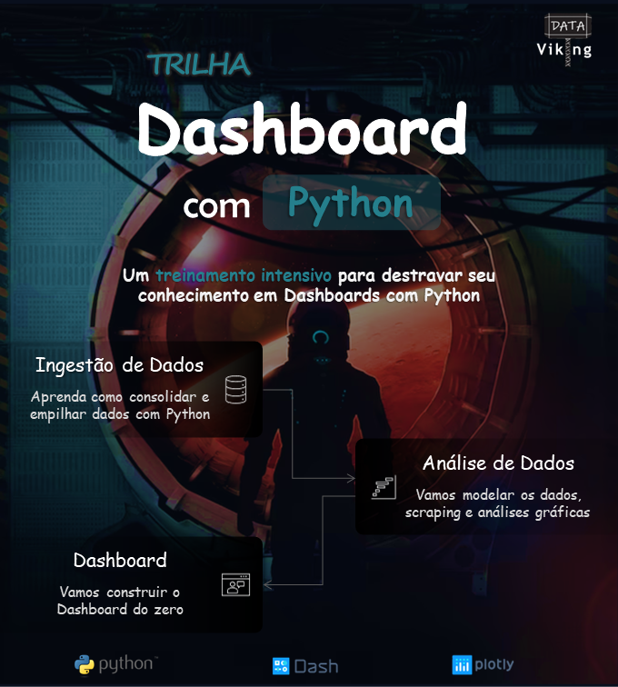

# DASHBOARD COM PYTHON
***Um Treinamento intensivo para destravar seu conhecimento***

**DIA 1: INGESTÃO DOS DADOS →** Aprendendo como consolidar e empilhar dados com Python.

**DIA 2: MODELAGEM DOS DADOS →** Detalhes de como os dados podem ser modelados, scraping e análises gráficas.

**DIA 3: CONSTRUÇÃO DO DASHBOARD →** Nesta etapa fizemos então o Dashboard do zero.  

